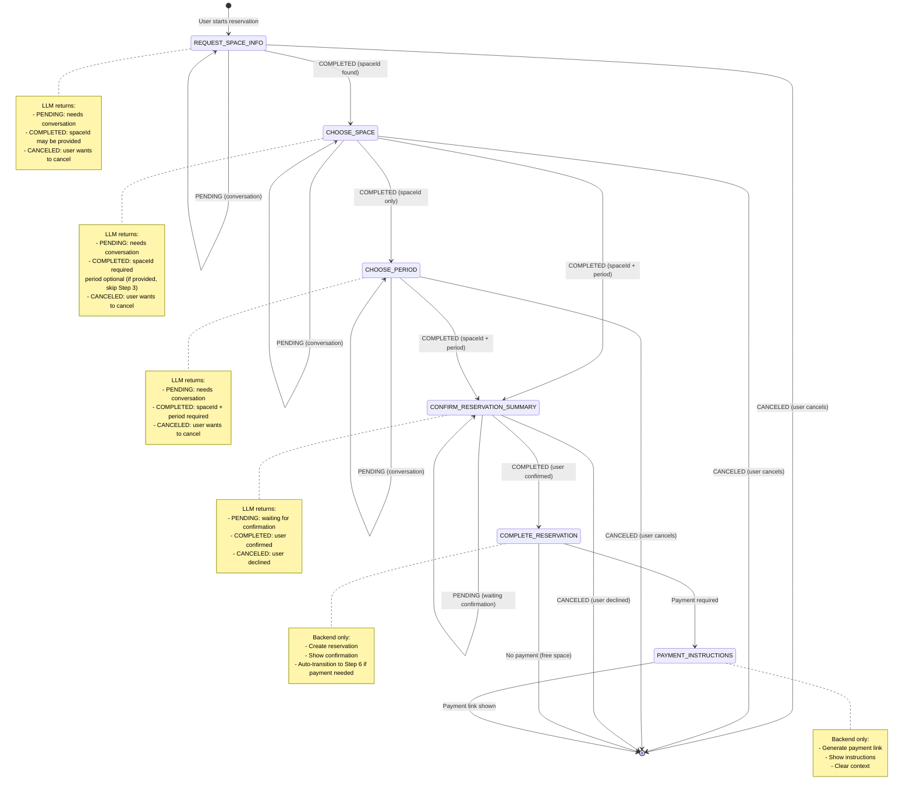

# Reservation State Machine Schema

## Overview

This document describes the complete state machine for the reservation workflow with LLM protocol integration.

## State Machine Diagram



## Detailed State Transitions

### Step 1: REQUEST_SPACE_INFO

**Purpose**: User asks for information about spaces or wants to start a reservation

**LLM Protocol Response**:

```json
{
  "status": "PENDING" | "COMPLETED" | "CANCELED",
  "response": "Conversational response to user",
  "spaceId": "UUID or null",
  "period": null
}
```

**Transitions**:

- **PENDING** → Stay in REQUEST_SPACE_INFO (return response to user, continue conversation)
- **COMPLETED** → Move to CHOOSE_SPACE (if spaceId provided) OR stay in REQUEST_SPACE_INFO (if spaceId null but user is just asking info)
- **CANCELED** → Clear context, end workflow

**Actions**:

- If PENDING: Return LLM response to user
- If COMPLETED with spaceId: Store spaceId, move to Step 2
- If COMPLETED without spaceId: Return response (user just asking info, not ready to reserve)
- If CANCELED: Clear context, return cancellation message

---

### Step 2: CHOOSE_SPACE

**Purpose**: Identify the exact spaceId UUID for the space user wants to reserve

**LLM Protocol Response**:

```json
{
  "status": "PENDING" | "COMPLETED" | "CANCELED",
  "response": "Conversational response to user",
  "spaceId": "UUID (required if COMPLETED)",
  "period": {
    "startDate": "YYYY-MM-DD or null",
    "endDate": "YYYY-MM-DD or null",
    "startTime": "HH:mm or null",
    "endTime": "HH:mm or null"
  } | null
}
```

**Transitions**:

- **PENDING** → Stay in CHOOSE_SPACE (return response to user, continue conversation)
- **COMPLETED with spaceId only** → Move to CHOOSE_PERIOD
- **COMPLETED with spaceId + period** → Move to CONFIRM_RESERVATION_SUMMARY (skip Step 3)
- **CANCELED** → Clear context, end workflow

**Actions**:

- If PENDING: Return LLM response to user
- If COMPLETED:
  - Validate spaceId is present (error if missing)
  - Store spaceId
  - If period provided: Store period, move to Step 4
  - If period null: Move to Step 3
- If CANCELED: Clear context, return cancellation message

**Edge Cases**:

- User provides different spaceId mid-flow: Update context, continue
- User wants to change space: LLM returns CANCELED or new spaceId

---

### Step 3: CHOOSE_PERIOD

**Purpose**: Get reservation dates and times from user

**LLM Protocol Response**:

```json
{
  "status": "PENDING" | "COMPLETED" | "CANCELED",
  "response": "Conversational response to user",
  "spaceId": "UUID (should match context)",
  "period": {
    "startDate": "YYYY-MM-DD (required if COMPLETED)",
    "endDate": "YYYY-MM-DD (required if COMPLETED)",
    "startTime": "HH:mm or null",
    "endTime": "HH:mm or null"
  } | null
}
```

**Transitions**:

- **PENDING** → Stay in CHOOSE_PERIOD (return response to user, continue conversation)
- **COMPLETED** → Move to CONFIRM_RESERVATION_SUMMARY (automatically show summary)
- **CANCELED** → Clear context, end workflow

**Actions**:

- If PENDING: Return LLM response to user (LLM conversing to find available period)
- If COMPLETED:
  - Validate spaceId and period are present (error if missing)
  - Store period (startDate, endDate, startTime, endTime)
  - Move to Step 4 (summary will be shown automatically)
- If CANCELED: Clear context, return cancellation message

**Edge Cases**:

- User wants to modify period: LLM returns new period, update context, return to Step 4
- User wants different space: LLM returns CANCELED or new spaceId, reset to Step 2

---

### Step 4: CONFIRM_RESERVATION_SUMMARY

**Purpose**: Show reservation summary and wait for user confirmation

**LLM Protocol Response**:

```json
{
  "status": "PENDING" | "COMPLETED" | "CANCELED",
  "response": "Summary message or confirmation request",
  "spaceId": "UUID (should match context)",
  "period": {
    "startDate": "YYYY-MM-DD (should match context)",
    "endDate": "YYYY-MM-DD (should match context)",
    "startTime": "HH:mm or null",
    "endTime": "HH:mm or null"
  }
}
```

**Transitions**:

- **PENDING** → Stay in CONFIRM_RESERVATION_SUMMARY (waiting for user confirmation)
- **COMPLETED** → Move to COMPLETE_RESERVATION (user confirmed, create reservation)
- **CANCELED** → Clear context, end workflow (user declined)

**Actions**:

- If PENDING: Return LLM response to user (summary shown, waiting for confirmation)
- If COMPLETED:
  - User confirmed → Create reservation (backend)
  - Move to Step 5 (show confirmation)
  - If payment required → Auto-transition to Step 6
- If CANCELED:
  - User declined → Clear context, return cancellation message

**Edge Cases**:

- User wants to modify period: LLM returns CANCELED or new period, reset to Step 3
- User wants different space: LLM returns CANCELED or new spaceId, reset to Step 2

---

### Step 5: COMPLETE_RESERVATION

**Purpose**: Show reservation confirmation (backend only, no LLM)

**Trigger**: Automatically after Step 4 COMPLETED

**Actions**:

- Reservation already created in Step 4
- Display confirmation message with reservation details
- If payment required → Auto-transition to Step 6
- If no payment → Clear context, end workflow

**No LLM Protocol** (backend only)

---

### Step 6: PAYMENT_INSTRUCTIONS

**Purpose**: Generate and show payment link (backend only, no LLM)

**Trigger**: Automatically after Step 5 if payment required

**Actions**:

- Generate payment link using reservationId
- Display formatted message with payment URL
- Clear context after showing instructions

**No LLM Protocol** (backend only)

---

## User Change of Mind Detection

### Detection Methods

1. **LLM Detection**: LLM analyzes user message and returns `status=CANCELED`
2. **Keyword Detection**: Check for keywords like "annuler", "recommencer", "autre chose", "changer"
3. **Router Detection**: If router detects new workflow type, clear reservation context

### Actions on Change of Mind

- **Clear context**: Remove all reservation state
- **Return message**: Inform user that reservation is cancelled
- **Allow new workflow**: User can start fresh reservation or other workflow

### Examples

- User says "non finalement je veux réserver autre chose" → CANCELED, clear context
- User says "annuler" → CANCELED, clear context
- User mentions different space → LLM returns new spaceId or CANCELED
- Router detects GENERAL workflow → Clear reservation context

---

## Error Handling

### Invalid JSON Response

- **Action**: Fallback to text parsing or return error message
- **Recovery**: Ask LLM again with clearer instructions

### Missing Required Fields

- **Step 2 COMPLETED without spaceId**: Log error, return PENDING to ask again
- **Step 3 COMPLETED without period**: Log error, return PENDING to ask again
- **Step 4 COMPLETED without confirmation**: Treat as PENDING

### Invalid Format

- **Invalid spaceId format**: Log error, return to Step 2
- **Invalid date format**: Log error, return to Step 3
- **Invalid time format**: Log error, use defaults (00:00, 23:59)

---

## Edge Cases Summary

| Case                                     | Detection                              | Action                            |
| ---------------------------------------- | -------------------------------------- | --------------------------------- |
| User provides all info at once           | Step 2 COMPLETED with spaceId + period | Skip Step 3, move to Step 4       |
| User wants different space mid-flow      | LLM returns new spaceId                | Update context, continue workflow |
| User wants to modify period after Step 3 | LLM returns new period in Step 4       | Update context, return to Step 4  |
| User cancels at any step                 | LLM returns CANCELED                   | Clear context, end workflow       |
| Payment not required                     | After Step 5, check reservation type   | Skip Step 6, clear context        |
| User changes mind completely             | Router detects new workflow      | Clear context, start new workflow |

---

## State Persistence

### Context Storage

- **Step**: Current reservation step
- **spaceId**: Identified space UUID
- **period**: Reservation period (startDate, endDate, startTime, endTime)
- **summaryShown**: Boolean flag for Step 4
- **reservationCreated**: Boolean flag for Step 5
- **reservationId**: Created reservation UUID
- **paymentLinkGenerated**: Boolean flag for Step 6

### Context Clearing

- On CANCELED status
- On workflow completion (after Step 6 or Step 5 if no payment)
- On router detecting new workflow type
- On explicit user cancellation
